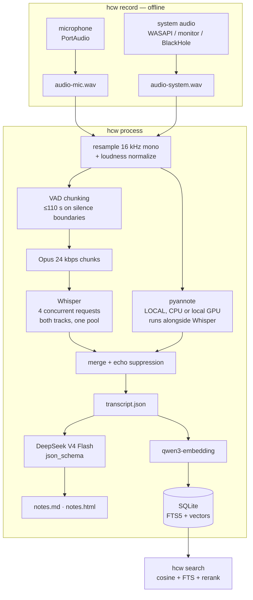

# helmcode-whisper

Self-hosted meeting notes with open models.

It records your microphone and your system audio as two separate tracks,
transcribes them with **Whisper large-v3** on the [Helmcode](https://helmcode.com)
API, separates speakers **locally** with pyannote, and writes structured notes —
summary, decisions, action items, open questions, quotes — with **DeepSeek V4
Flash**. Everything it produces stays in a folder on your disk, and you can
search all of it by meaning.

```bash
hcw record -t "pricing review"     # Ctrl+C when the meeting ends
hcw process                        # transcribe, diarize, summarize, index
hcw search "what did we say about the enterprise tier"
```

---

## Why this exists

Meeting-notes products are convenient and they are also the single most
sensitive audio stream in a company: pricing, salaries, legal exposure, customer
names, and — literally — everybody's voice.

Under the GDPR a voice recording used to tell people apart is **biometric data**:
special-category personal data under Article 9, on the same footing as health
records. Most note-taking tools ship it to a third party for both transcription
*and* speaker identification, and their retention terms are a paragraph on a
pricing page.

This tool draws the line in a different place:

| Step | Where it runs | What leaves the machine |
|---|---|---|
| Recording | Your machine | Nothing. `record` never opens a socket |
| Transcription | Helmcode API | Opus chunks of the meeting audio |
| **Speaker separation** | **Your machine** | **Nothing** |
| Notes | Helmcode API | The transcript text |
| Search index | Your machine (SQLite) | Passage text, to be embedded |
| Storage | `~/helmcode-whisper/` | Nothing |

The one third party is Helmcode: inference on dedicated GPUs in the EU, zero
logs, and no training on your data. Diarization does not even go that far — the
step that turns a voice into an identity runs on your CPU, always, by design.

There is one other host in the picture, and it is worth naming rather than
hiding: if you enable diarization, pyannote downloads its model weights from
huggingface.co the first time it runs. No meeting content is sent there, and you
can pre-download the weights and then work fully offline.

## What this is not

- **Not a bot that joins your meetings.** It records the audio your machine
  plays and hears. Nothing appears in the participant list.
- **Not real-time.** You record, then you process. Live transcription is on the
  roadmap, not in v1.
- **Not a product.** It is a reference project for the article *"build your own
  Granola with open models"*. Granola and its competitors have calendar
  integration, template libraries and years of polish. This does not pretend to.

---

## Quickstart

Requirements: Python 3.11+, `ffmpeg` on your PATH, and a Helmcode API key.

```bash
uv tool install git+https://github.com/helmcode/helmcode-whisper

cp .env.example .env                    # then paste your HELMCODE_API_KEY
hcw doctor                              # checks devices, ffmpeg, models, everything
```

Not on PyPI. Installing from git is one line either way, and a package index
entry is a promise about versions that a 0.1 with two untested platforms has no
business making yet.

Working on it instead of with it:

```bash
git clone https://github.com/helmcode/helmcode-whisper
cd helmcode-whisper
uv venv && uv pip install -e ".[dev]"   # or: python -m venv .venv && pip install -e ".[dev]"
```

`hcw doctor` is the first thing to run and the first thing to paste into an
issue. It tells you exactly which of the moving parts is not in place.

Then:

```bash
hcw record -t "pricing review"
# ... have the meeting ... Ctrl+C to stop

hcw process
```

`process` prints the summary and the action items in your terminal and writes
`notes.md`, `notes.html` and `transcript.json` next to the audio. Real output
from a three-minute two-party recording, colour stripped:

```
P R O C E S S I N G
  ~/helmcode-whisper/2026-08-12-pricing-review

 + mic     2.2 min  1.2 min of speech in 2 chunks
 + system  3.0 min  1.8 min of speech in 2 chunks
  transcribing ------------------------------ 4/4 0:00:05
 + transcribed 11 segments  language es
 + diarization  47 turns on cpu  89s, alongside transcription
 + transcript  13 turns  SPEAKER_00, Me, SPEAKER_02
 + notes generated via json_schema  958 in / 624 out tokens
 + indexed  11 passages  11 embedded

S U M M A R Y ────────────────────────────────────────────────────────────
  La reunión revisó el estado del proyecto de notas de reuniones. Se
confirmó que la transcripción funciona con Whisper y el troceo por
silencios. Se decidió mantener la diarización como opcional y documentar
el tiempo real que tarda en la máquina. [...]

D E C I S I O N S
  · La diarización se mantiene como opcional.
  · Se documentará el tiempo real que tarda la diarización en la máquina.

A C T I O N   I T E M S
  □ Conseguir la clave de la API y aceptar las condiciones de Hugging
    Face.  Borja · viernes

F I L E S ─────────────────────────────────────────────────────────────────
 + notes.md         ~/helmcode-whisper/2026-08-12-pricing-review
 + notes.html       ~/helmcode-whisper/2026-08-12-pricing-review
 + transcript.json  ~/helmcode-whisper/2026-08-12-pricing-review

  prepare 2s  transcribe 5s  diarize 84s  notes 8s  index 2s   total 101s
```

Note `diarize 84s` against `diarization 89s`: diarization ran while the
transcription requests were in flight, so it only cost the pipeline what it had
left to do when they came back. The notes are in Spanish because that is what
`templates/notes.md` asks for — see [Customizing the notes](#customizing-the-notes).

### Getting system audio, per platform

This is the part that differs, and it is where nearly every support issue comes
from. Two tracks are recorded and never mixed: your microphone is "me", the
system loopback is "everyone else".

| Platform | How | Setup needed | Status |
|---|---|---|---|
| **Windows** | WASAPI loopback | None | Tested |
| **Linux** | PipeWire/PulseAudio monitor source | None | Implemented, not yet tested |
| **macOS** | BlackHole virtual device | Manual, see below | Implemented, not yet tested |

**Windows** — nothing to do. Windows exposes every output device as a hidden
loopback input; `hcw doctor` will show it next to `system`.

**Linux** — every sink has a `.monitor` source carrying exactly what it plays.
The tool asks `pactl` for your default sink and records its monitor. If
`hcw devices` shows no monitor, check that `pactl get-default-sink` returns
something and that PortAudio can see it.

**macOS** — macOS has no software route to the system mix; an app can only
record what the OS hands it, and the OS hands it nothing. The workaround is a
virtual audio device:

1. Install [BlackHole 2ch](https://existential.audio/blackhole/) (`brew install
   blackhole-2ch`).
2. Open **Audio MIDI Setup** → **+** → **Create Multi-Output Device**.
3. Tick both your real speakers/headphones **and** BlackHole. Set your real
   output as the primary (top of the list) so you still hear the meeting.
4. Set that Multi-Output Device as the system output in **Sound** settings.
5. Run `hcw doctor` — `system` should now show BlackHole.

These steps are written from the BlackHole documentation rather than from a
machine that ran them, which is the same reason macOS is marked untested in the
table above. A native ScreenCaptureKit helper would remove the whole dance and
is on the roadmap.

**No system audio at all?** The tool degrades on purpose: it records the
microphone only, warns you once, and the rest of the pipeline works. That is the
right mode for an in-person meeting with everyone around one laptop.

---

## Recording people is a legal act

Recording a conversation without telling the other people in it is illegal in
many jurisdictions and a bad idea in all of them. Rules differ by country and
sometimes within one — some places need only one participant's consent, others
need everyone's, and workplace recordings often carry extra obligations.

`hcw record` prints a reminder every single time it starts, and it will keep
doing that. Tell people, get their agreement, and if you are recording for work,
check with whoever owns that decision. This tool makes recording easy; it does
not make it lawful.

---

## Customizing the notes

The prompt is a file, not a string buried in the source:

```
templates/notes.md
```

Edit it. Change the language, the tone, what counts as a decision, add a section
for risks — that is the whole point of running your own. An English variant
ships as `templates/notes.en.md`; point at any file with:

```bash
HCW_NOTES_TEMPLATE=~/my-notes-prompt.md hcw process
```

Available placeholders: `{{TITLE}}`, `{{DATE}}`, `{{DURATION}}`, `{{SPEAKERS}}`,
`{{TRANSCRIPT}}`.

What the template does *not* control is the **shape** of the output — the five
sections are fixed by a JSON schema so that `notes.md`, `notes.html` and the
search index never have to guess. To change the sections themselves, edit
`NOTES_SCHEMA` in `src/helmcode_whisper/pipeline/notes.py`.

---

## Architecture



Everything inside `hcw record` is offline. Only the three boxes naming a model
leave the machine, and they only reach `HELMCODE_BASE_URL` —
`tests/test_no_egress.py` fails the build if any other host appears in the
package.

### Decisions worth explaining

**Two tracks, never mixed.** Recording the microphone and the system separately
solves half of diarization for free: near versus far is decided by which file
the audio is in, and pyannote only has to untangle the remote side.

**Chunking is load-bearing, not an optimization.** The transcription endpoint
caps a request at 25 MB and about two minutes of audio. A 60-minute meeting is
therefore ~35 chunks per track, ~70 requests. Chunks are cut on silence found by
VAD so sentences survive; long silences fall outside every chunk and are never
uploaded; and only when speech runs unbroken past the limit is a cut forced,
with 2 s of overlap so the model has context on both sides. Requests run four at
a time through a single pool covering both tracks — sequentially, `process`
would take longer than the meeting did, and a pool per track would leave the
microphone waiting for the system audio to finish. Four rather than more
because the API allows five parallel requests per key and 429s the sixth;
`HCW_STT_CONCURRENCY` is there if your key says otherwise. On an 11-chunk
recording, one at a time took 22 s and four at a time took 2-3 s.

**Diarization runs underneath transcription.** It needs the prepared system
track and nothing else — not the transcript — so it starts as soon as that file
exists rather than after the last chunk comes back. It is local CPU work and
transcription is almost entirely idle waiting on HTTP, so running them in
sequence means each one starves the resource the other wants. Since diarization
is the most expensive step by a wide margin, what it costs the pipeline is now
only whatever it still has left to do when transcription finishes. `meta.json`
records both numbers: `timings_seconds.diarize` is the wait, and
`diarization_seconds` is what it cost on its own.

**Speakers are assigned per word, not per segment.** Whisper draws segment
boundaries from punctuation and prosody, and it will happily put two people in
one segment — on the first real recording, pyannote found 18 turns where Whisper
returned 3 segments. Asking for word timestamps alongside segment timestamps (one
request, both granularities) makes it possible to cut a segment exactly where the
speaker changes, mid-sentence if that is where the handover happened. A change
has to hold for three words to count, so an interjected "yes" does not shatter a
sentence into confetti.

**Echo suppression.** If you are not wearing headphones, your microphone hears
the remote audio coming out of your speakers, and a naive merge says everything
twice. A mic segment is dropped when most of its words appear in what the remote
side was saying at that moment — words of four letters or more, since function
words are in every window ever recorded and would drag unrelated speech up to
the threshold.

The comparison is against the whole window rather than segment against segment,
and that detail is the difference between working and not. The two tracks are
transcribed independently, so Whisper cuts the echoed copy differently from the
original: a mic segment routinely straddles two system segments and matches
neither. Measured against an hour of audio played through speakers, the
segment-to-segment version caught 41% of the echo; against the window, 79%, with
no genuine speech deleted on a recording made to test exactly that. The
threshold sits in the gap between the two populations rather than against either
edge, because leaving an echo in is visible and recoverable while deleting what
somebody said is neither.

Dropped segments stay in `transcript.json` with a reason attached, so the
decision is auditable. Wear headphones anyway; it is better audio, and no
heuristic beats not having the problem.

### Every step is cached

Each step writes its result to the meeting's `.cache/` before the next one
starts. If the merge fails, `process` does not re-transcribe an hour of audio.
Fix the problem, run it again, and only the broken step costs anything.
`--force` throws the cache away.

Cached entries are keyed by a content hash of the audio they came from, not by
position, so nothing survives that should not: change the recording and every
downstream result for it is a miss. That covers the encoded chunks, the
transcription of each one, the chunk plan, and the diarization.

---

## What ends up on disk

```
~/helmcode-whisper/2026-08-11-pricing-review/
    audio-mic.wav        your microphone
    audio-system.wav     everyone else
    transcript.json      segments with timestamps and speakers
    notes.json           the notes as structure: decisions, owners, due dates
    notes.md             the same notes, for reading
    notes.html           the same notes, styled, fully self-contained
    meta.json            devices, timings, token counts, language
    .cache/              chunk audio and per-step results
```

`notes.json` is the one to build on. `notes.md` reads well and `notes.html` shares
well, and neither can be turned back into an owner and a due date without
guessing.

`~/helmcode-whisper/index.sqlite3` holds the search index across all meetings.
Delete a meeting folder and it is gone; nothing else has a copy.

### Driving it from something other than a terminal

```bash
hcw process --progress-json
```

One JSON object per line on stdout, with the terminal output moved to stderr so
the two audiences do not interleave. Every step reports when it starts and
finishes, transcription reports fragments done out of the total, and diarization
carries an estimate derived from the factor measured on this machine — omitted
entirely on a GPU, which nobody has measured.

```
{"event": "step", "step": "transcribe", "state": "running", "total": 69}
{"event": "chunks", "done": 34, "total": 69}
{"event": "step", "step": "diarize", "state": "running", "estimate_seconds": 1620}
```

Fields are additive: ignore one you do not know, and a new one will not break a
reader that already works.

---

## Search

```bash
hcw search "what did we agree about the enterprise tier"
```

Three stages: vector recall over every passage you have ever recorded, FTS5
keyword recall in parallel, and a rerank pass over the union. The first finds
"the number we charge" when you asked about pricing; the second catches the
exact product name the embedding blurred; the third puts the right one first.

Without an API key it degrades to keyword search and says so in the output
rather than quietly returning worse answers.

---

## Speaker diarization

Optional, local, and off by default because it pulls in torch:

```bash
uv pip install -e ".[diarize]"
```

Then, once:

1. Accept the terms of **three** gated Hugging Face repos:
   - [pyannote/speaker-diarization-3.1](https://huggingface.co/pyannote/speaker-diarization-3.1)
   - [pyannote/segmentation-3.0](https://huggingface.co/pyannote/segmentation-3.0)
   - [pyannote/speaker-diarization-community-1](https://huggingface.co/pyannote/speaker-diarization-community-1)

   Every guide names the first two. pyannote.audio 4 pulls the third while
   loading the 3.1 pipeline, and its 403 only appears *after* the other two have
   downloaded — which looks exactly like "I accepted the terms and it still
   fails". Accept all three and it works.
2. Put a Hugging Face token in `.env` as `HF_TOKEN`.

It uses a local CUDA GPU if you have one and CPU otherwise. On CPU it is the
slowest step in the pipeline by a wide margin, which is why it is started early
and runs while the transcription requests are in flight — on a meeting whose
transcription takes longer than its diarization, it becomes free. Skip it with
`--no-diarize` and you still get the me/others split, which is often enough for
a two-party call.

---

## Troubleshooting audio

Nine out of ten problems are capture problems. Start with `hcw doctor`.

**`system  none found`** — see the platform section above. On Windows, check
that an output device is actually active. On Linux, check `pactl
get-default-sink`. On macOS, this is expected until BlackHole is installed.

**The system track is silent** — something was routed elsewhere. On macOS,
confirm the Multi-Output Device is the *system* output, not just an available
one. On Windows, confirm the meeting app is playing through the default device
and not a headset the loopback does not cover.

**Everything is said twice in the transcript** — echo suppression did not catch
it, usually because the mic version was garbled enough that the texts stopped
matching. Wear headphones.

**`dropped audio blocks`** at the end of a recording — the machine could not
keep up with the disk writer. The transcript will have holes. Close whatever
else was hammering the disk.

**Ctrl+C during `record` does not stop it immediately** — it finishes flushing
the current buffer first. Give it a second; the WAV is closed cleanly.

**`524` from the transcription endpoint** — a chunk was too long for the
endpoint. Should not happen with the default limits; if it does, open an issue
with the `chunks` block from `meta.json`.

## Other things that bite

**Everyone in the meeting was speaking English but the transcript is in
Spanish** — Whisper picks one language per request, and a request is a chunk. A
chunk containing two languages gets transcribed in one of them and *translated*
from the other. Pass `--language` when you know it; expect the effect when a
meeting genuinely code-switches. Per-chunk language detection is why this shows
up as whole passages in the wrong language rather than odd words.

**`hcw doctor` says pyannote "will not import: cannot import name ... from
`torch._dynamo`"** — pyannote is installed and its torch is not usable, usually
after torch was upgraded in place and left a half-matched tree behind.
Reinstall the extra: `uv pip install --reinstall 'helmcode-whisper[diarize]'`.
Until then `process` keeps running with the me/others split. This message
deliberately does *not* say "pyannote is not installed" — that is a different
problem, and sending you to install something you already have is worse than
saying nothing.

**`OSError [WinError 4551]` loading `torch/lib/shm.dll` on Windows** — Smart App
Control blocked an unsigned library. It resolved itself here once Windows had
evaluated the file, so try again before doing anything drastic. If it persists,
your choices are to turn Smart App Control off — **which cannot be undone
without reinstalling Windows** — or to run diarization somewhere else and use
`--no-diarize` locally. `process` degrades to the me/others split either way
rather than failing.

---

## Roadmap

Honest version, in rough order of how much they would improve the thing:

- **Real-time transcription** while the meeting runs, instead of `record` then
  `process`.
- **A native macOS capture helper** using ScreenCaptureKit, so BlackHole and the
  Multi-Output dance disappear.
- **A local UI** — the CLI is fine for the person who built it and a wall for
  everyone else.
- **Speaker naming**: `SPEAKER_00` becomes "Ana" once, and stays Ana across
  every future meeting via voice embeddings.
- **Calendar awareness**, so a meeting gets its title and attendees without
  being told.

Not planned: a hosted version, a bot that joins calls, or anything that moves
the audio off your machine.

---

## License

Apache-2.0.
