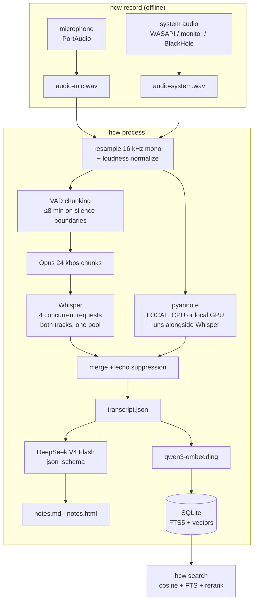

# helmcode-whisper

Self-hosted meeting notes with open models.

It records your microphone and your system audio as two separate tracks,
transcribes them with **Whisper large-v3** on the [Helmcode](https://helmcode.com)
API, separates speakers **locally** with pyannote, and writes structured notes
with **DeepSeek V4 Flash**: a summary, the decisions, the action items, the
open questions and the quotes. Everything it produces stays in a folder on your
disk, and you can search all of it by meaning.

```bash
hcw record -t "pricing review"     # Ctrl+C when the meeting ends
hcw process                        # transcribe, diarize, summarize, index
hcw search "what did we say about the enterprise tier"
```

---

## Why this exists

Meeting-notes products are convenient and they are also the single most
sensitive audio stream in a company: pricing, salaries, legal exposure, customer
names, and literally everybody's voice.

Under the GDPR a voice recording used to tell people apart is **biometric data**:
special-category personal data under Article 9, on the same footing as health
records. Most note-taking tools ship it to a third party for both transcription
*and* speaker identification, and their retention terms are a paragraph on a
pricing page.

This tool draws the line in a different place:

| Step | Where it runs | What leaves the machine |
|---|---|---|
| Recording | Your machine | Nothing. `record` never opens a socket |
| Transcription | Helmcode API | Opus chunks of the meeting audio |
| **Speaker separation** | **Your machine** | **Nothing** |
| Notes | Helmcode API | The transcript text |
| Search index | Your machine (SQLite) | Passage text, to be embedded |
| Storage | `~/helmcode-whisper/` | Nothing |

The one third party is Helmcode: inference on dedicated GPUs in the EU, zero
logs, and no training on your data. Diarization doesn't even go that far. The
step that turns a voice into an identity runs on your CPU, always, by design.

There's one other host in the picture, and it's worth naming rather than
hiding. If you enable diarization, huggingface.co is involved twice: `hcw
doctor` asks it whether you have accepted the terms of the three gated pyannote
repos, which sends your token and those three names, and pyannote then downloads
the model weights the first time it runs. No meeting content goes to either.
Pre-download the weights and you can work fully offline.

## What this is not

- **Not a bot that joins your meetings.** It records the audio your machine
  plays and hears. Nothing appears in the participant list.
- **Not real-time.** You record, then you process. Live transcription is on the
  roadmap, not in v1.
- **Not a product.** It is a reference project for the article *"build your own
  Granola with open models"*. Granola and its competitors have calendar
  integration, template libraries and years of polish. This doesn't pretend to.

---

## Quickstart

Requirements: Python 3.11+, `ffmpeg` on your PATH, and a Helmcode API key.

```bash
uv tool install git+https://github.com/helmcode/helmcode-whisper

cp .env.example .env                    # then paste your HELMCODE_API_KEY
hcw doctor                              # checks devices, ffmpeg, models, everything
```

Not on PyPI. Installing from git is one line either way, and publishing to an
index promises a stability that a 0.1 with two untested platforms has no
business promising yet.

Working on it instead of with it:

```bash
git clone https://github.com/helmcode/helmcode-whisper
cd helmcode-whisper
uv venv && uv pip install -e ".[dev]"   # or: python -m venv .venv && pip install -e ".[dev]"
```

`hcw doctor` is the first thing to run and the first thing to paste into an
issue. It tells you exactly which of the moving parts isn't in place.

Then:

```bash
hcw record -t "pricing review"
# ... have the meeting ... Ctrl+C to stop

hcw process
```

`process` prints the summary and the action items in your terminal and writes
`notes.md`, `notes.html` and `transcript.json` next to the audio. The step lines
it prints on the way, colour stripped:

```
P R O C E S S I N G
  ~/helmcode-whisper/2026-08-31-pricing-review

 + mic     1.1 min  0.5 min of speech in 1 chunk
 + system  1.1 min  0.6 min of speech in 1 chunk
  transcribing -------------------------------- 2/2 0:00:02
 + transcribed 5 segments  language es
 + diarization  15 turns on cuda  11s, alongside transcription
 + notes generated via json_schema  1142 in / 8724 out tokens
 + indexed  11 passages  11 embedded

  prepare 1s  transcribe 3s  diarize 8s  notes 42s  index 1s   total 55s
```

That is a one-minute two-track recording on a GTX 1660 Ti, with the summary,
decisions and action items it also prints left out for length.

Two things in those numbers are worth reading. `diarize 8s` against
`diarization 11s` is the overlap: diarization ran while the transcription
requests were in flight, so it only cost the pipeline what it had left to do
when they came back. And `notes 42s` of a 55-second run is the whole point of
where the time goes now: deepseek-v4-flash reasons before it answers, and it
spent 8,724 output tokens on a one-minute meeting. Transcription and
diarization are no longer the slow parts. The notes are.

The notes are in Spanish because that's what `templates/notes.md` asks for. See
[Customizing the notes](#customizing-the-notes).

### Getting system audio, per platform

This is the part that differs, and it's where nearly every support issue comes
from. Two tracks are recorded and never mixed: your microphone is "me", the
system loopback is "everyone else".

| Platform | How | Setup needed | Status |
|---|---|---|---|
| **Windows** | WASAPI loopback | None | Tested |
| **Linux** | PipeWire/PulseAudio monitor source | None | Implemented, not yet tested |
| **macOS** | BlackHole virtual device | Manual, see below | Implemented, not yet tested |

**Windows.** Nothing to do. Windows exposes every output device as a hidden
loopback input; `hcw doctor` will show it next to `system`.

**Linux.** Every sink has a `.monitor` source carrying exactly what it plays.
The tool asks `pactl` for your default sink and records its monitor. If
`hcw devices` shows no monitor, check that `pactl get-default-sink` returns
something and that PortAudio can see it.

**macOS.** There is no software route to the system mix on macOS. An app can
only record what the OS hands it, and the OS hands it nothing. The workaround is
a virtual audio device:

1. Install [BlackHole 2ch](https://existential.audio/blackhole/) (`brew install
   blackhole-2ch`).
2. Open **Audio MIDI Setup** → **+** → **Create Multi-Output Device**.
3. Tick both your real speakers/headphones **and** BlackHole. Set your real
   output as the primary (top of the list) so you still hear the meeting.
4. Set that Multi-Output Device as the system output in **Sound** settings.
5. Run `hcw doctor`. `system` should now show BlackHole.

These steps come from the BlackHole documentation, not from a machine that ran
them. That's the same reason macOS is marked untested in the table above. A
native ScreenCaptureKit helper would remove the whole dance and is on the
roadmap.

**No system audio at all?** The tool degrades on purpose: it records the
microphone only, warns you once, and the rest of the pipeline works. That is the
right mode for an in-person meeting with everyone around one laptop.

---

## Recording people is a legal act

Recording a conversation without telling the other people in it is illegal in
many jurisdictions and a bad idea in all of them. Rules differ by country and
sometimes within one. Some places need only one participant's consent, others
need everyone's, and workplace recordings often carry extra obligations.

`hcw record` prints a reminder every single time it starts, and it will keep
doing that. Tell people, get their agreement, and if you're recording for work,
check with whoever owns that decision. This tool makes recording easy; it
doesn't make it lawful.

---

## Customizing the notes

The prompt is a file, not a string buried in the source:

```
templates/notes.md
```

Edit it. Change the language, the tone, what counts as a decision, add a section
for risks. That is the whole point of running your own. An English variant
ships as `templates/notes.en.md`; point at any file with:

```bash
HCW_NOTES_TEMPLATE=~/my-notes-prompt.md hcw process
```

Available placeholders: `{{TITLE}}`, `{{DATE}}`, `{{DURATION}}`, `{{SPEAKERS}}`,
`{{TRANSCRIPT}}`.

The model is a variable too. `deepseek-v4-flash` is the default because it's
the strongest general model in the catalog with no tier attached, but any chat
model the API serves will do:

```bash
HCW_NOTES_MODEL=qwen3.6 hcw process --force
```

That is also the fix if structured output ever stops working: `json_schema` is
documented as validated on `qwen3.6` and `gemma4`, and the ladder in
`pipeline/notes.py` walks down to looser modes rather than failing, so a change
here shows up as a different `mode` in `meta.json` and not as an error.

What the template does *not* control is the **shape** of the output. The five
sections are fixed by a JSON schema so that `notes.md`, `notes.html` and the
search index never have to guess. To change the sections themselves, edit
`NOTES_SCHEMA` in `src/helmcode_whisper/pipeline/notes.py`.

---

## Architecture



Everything inside `hcw record` is offline. Only the three boxes naming a model
leave the machine, and they only reach `HELMCODE_BASE_URL`.
`tests/test_no_egress.py` fails the build if any other host appears in the
package.

### Decisions worth explaining

**Two tracks, never mixed.** Recording the microphone and the system separately
solves half of diarization for free: near versus far is decided by which file
the audio is in, and pyannote only has to untangle the remote side.

**Chunking outlived the limit that caused it.** It started as a workaround: the
endpoint used to cap a request at about two minutes of audio and answer anything
longer with a 524. That cap is gone. Posting Opus straight at the endpoint, one
request at a time:

| audio | size | result | time |
|---|---|---|---|
| 2 min | 0.36 MB | 200 | 3.6 s |
| 8 min | 1.43 MB | 200 | 7.3 s |
| 30 min | 5.37 MB | 200 | 22.5 s |
| 60 min | 10.73 MB | 200 | 42.6 s |
| 90 min | 16.10 MB | 200 | 73.5 s |

Ninety minutes in one request, with word timestamps intact to the last second.
So chunks are now eight minutes rather than 110 seconds, and a 60-minute meeting
is about 8 per track instead of 35.

They are still chunks, because the mechanism was never really about the cap.
Long silences fall outside every chunk and are never uploaded. Each chunk's
result is cached on its own, so a failure downstream costs one piece instead of
the hour. The progress bar has something to count. And going all the way to one
request per track would cost something real: Whisper detects a language per
request, so a single request forces one language on the whole meeting, while a
smaller chunk at least confines the damage. Eight minutes is where those pull
against each other about evenly.

Chunks are still cut on silence found by VAD so sentences survive, and only when
speech runs unbroken past the limit is a cut forced, with 2 s of overlap so the
model has context on both sides. Requests run four at a time through a single
pool covering both tracks: a pool per track would leave the microphone waiting
for the system audio to finish. Four rather than more because the API allows
five parallel requests per key and 429s the sixth; `HCW_STT_CONCURRENCY` is
there if your key says otherwise. On an 11-chunk recording, one at a time took
22 s and four at a time took 2-3 s.

**Diarization runs underneath transcription.** It needs the prepared system
track and nothing else, not even the transcript, so it starts as soon as that
file exists rather than after the last chunk comes back. It is local CPU work and
transcription is almost entirely idle waiting on HTTP, so running them in
sequence means each one starves the resource the other wants. Since diarization
is the most expensive step by a wide margin, what it costs the pipeline is now
only whatever it still has left to do when transcription finishes. `meta.json`
records both numbers: `timings_seconds.diarize` is the wait, and
`diarization_seconds` is what it cost on its own.

**Speakers are assigned per word, not per segment.** Whisper draws segment
boundaries from punctuation and prosody, and it will happily put two people in
one segment. On the first real recording, pyannote found 18 turns where Whisper
returned 3 segments. Asking for word timestamps alongside segment timestamps (one
request, both granularities) makes it possible to cut a segment exactly where the
speaker changes, mid-sentence if that's where the handover happened. A change
has to hold for three words to count, so an interjected "yes" doesn't shatter a
sentence into confetti.

**Echo suppression.** If you're not wearing headphones, your microphone hears
the remote audio coming out of your speakers, and a naive merge says everything
twice. A mic segment is dropped when most of its words appear in what the remote
side was saying at that moment. Only words of four letters or more count, since
function words are in every window ever recorded and would drag unrelated speech
up to the threshold.

The comparison is against the whole window rather than segment against segment,
and that one detail is what makes it work at all. The two tracks are
transcribed independently, so Whisper cuts the echoed copy differently from the
original: a mic segment routinely straddles two system segments and matches
neither. Measured against an hour of audio played through speakers, the
segment-to-segment version caught 41% of the echo; against the window, 79%, with
no genuine speech deleted on a recording made to test exactly that. The
threshold sits in the gap between the two populations rather than against either
edge, because leaving an echo in is visible and recoverable while deleting what
somebody said is neither.

Dropped segments stay in `transcript.json` with a reason attached, so the
decision is auditable. Wear headphones anyway; it's better audio, and no
heuristic beats not having the problem.

### Every step is cached

Each step writes its result to the meeting's `.cache/` before the next one
starts. If the merge fails, `process` doesn't re-transcribe an hour of audio.
Fix the problem, run it again, and only the broken step costs anything.
`--force` throws the cache away.

Cached entries are keyed by a content hash of the audio they came from, not by
position, so nothing survives that shouldn't: change the recording and every
downstream result for it is a miss. That covers the encoded chunks, the
transcription of each one, the chunk plan, and the diarization.

---

## What ends up on disk

```
~/helmcode-whisper/2026-08-11-pricing-review/
    audio-mic.wav        your microphone
    audio-system.wav     everyone else
    transcript.json      segments with timestamps and speakers
    notes.json           the notes as structure: decisions, owners, due dates
    notes.md             the same notes, for reading
    notes.html           the same notes, styled, fully self-contained
    meta.json            devices, timings, token counts, language
    .cache/              chunk audio and per-step results
```

`notes.json` is the one to build on. `notes.md` reads well and `notes.html` shares
well, and neither can be turned back into an owner and a due date without
guessing.

`~/helmcode-whisper/index.sqlite3` holds the search index across all meetings.
Delete a meeting folder and it's gone; nothing else has a copy.

### Driving it from something other than a terminal

```bash
hcw process --progress-json
```

One JSON object per line on stdout, with the terminal output moved to stderr so
the two audiences don't interleave. Every step reports when it starts and
finishes, transcription reports fragments done out of the total, and diarization
carries an estimate derived from the factor measured on this machine. On a GPU
the estimate is left out entirely, because nobody has measured one.

```
{"event": "step", "step": "transcribe", "state": "running", "total": 69}
{"event": "chunks", "done": 34, "total": 69}
{"event": "step", "step": "diarize", "state": "running", "estimate_seconds": 1620}
```

Fields are additive: ignore one you don't know, and a new one won't break a
reader that already works.

---

## Search

```bash
hcw search "what did we agree about the enterprise tier"
```

Three stages: vector recall over every passage you have ever recorded, FTS5
keyword recall in parallel, and a rerank pass over the union. The first finds
"the number we charge" when you asked about pricing; the second catches the
exact product name the embedding blurred; the third puts the right one first.

Without an API key it degrades to keyword search and says so in the output
rather than quietly returning worse answers.

**Changing `HCW_EMBED_MODEL` isn't free.** Vectors from two models don't live
in the same space, so the index searches the ones the current model produced and
reports the rest instead of comparing numbers that don't mean anything:

```
  312 passages were embedded with another model and sit outside the semantic
  search - re-run `hcw process` on those meetings
```

They are still there and still reachable by keyword. `hcw process` on a meeting
re-embeds it with the model configured now; every other step comes back from
cache, so it costs one embedding call per meeting and nothing else.

---

## Speaker diarization

Optional, local, and off by default because it pulls in torch:

```bash
uv pip install -e ".[diarize]" --torch-backend=auto
```

**`--torch-backend=auto` is not optional on Windows, and it is the single
biggest thing on this page.** PyPI's Windows wheel for torch is CPU-only: 122 MB
against the 527 MB Linux build that carries CUDA. Install the extra without that
flag on a machine with a perfectly good NVIDIA GPU and `torch.cuda.is_available()`
comes back False, diarization runs on the CPU, and nothing tells you. This
project shipped its first version that way, on a machine with a GTX 1660 Ti in
it, and the only sign was one word in the output.

`hcw doctor` now reports the device and says so when it finds a GPU the
installed torch cannot use:

```
D I A R I Z A T I O N
 + pyannote ready
 + device  cuda  NVIDIA GeForce GTX 1660 Ti
```

Then, once:

1. Accept the terms of **three** gated Hugging Face repos:
   - [pyannote/speaker-diarization-3.1](https://huggingface.co/pyannote/speaker-diarization-3.1)
   - [pyannote/segmentation-3.0](https://huggingface.co/pyannote/segmentation-3.0)
   - [pyannote/speaker-diarization-community-1](https://huggingface.co/pyannote/speaker-diarization-community-1)

   Every guide names the first two. pyannote.audio 4 pulls the third while
   loading the 3.1 pipeline, and its 403 only appears *after* the other two have
   downloaded, which looks exactly like "I accepted the terms and it still
   fails". Accept all three and it works.
2. Put a Hugging Face token in `.env` as `HF_TOKEN`.

It is the slowest step in the pipeline by a wide margin, and how slow depends
entirely on that flag above. The same 3-minute two-speaker track, same machine,
same pyannote 3.1:

| device | time | speed | result |
|---|---|---|---|
| CPU, 15 threads | 110.3 s | 1.6x real time | 42 turns, 2 speakers |
| GTX 1660 Ti | 16.1 s | 11.2x real time | 42 turns, 2 speakers |

Identical output, 6.9x apart. Extrapolated to an hour of continuous speech that
is 37 minutes against 5. A track with ordinary silence in it comes out faster
than both, since silence is still audio pyannote has to read.

It starts early and runs while the transcription requests are in flight, which
used to make it nearly free. That is no longer true, and it is worth saying so
plainly: the overlap was written when transcription was the slow half, and now
that 90 minutes of audio comes back in 73 seconds, transcription is never the
slower of the two. The overlap hides seconds. The GPU hides minutes.

Skip it with `--no-diarize` and you still get the me/others split, which is
often enough for a two-party call.

---

## Troubleshooting audio

Nine out of ten problems are capture problems. Start with `hcw doctor`.

**`system  none found`.** See the platform section above. On Windows, check
that an output device is actually active. On Linux, check `pactl
get-default-sink`. On macOS, this is expected until BlackHole is installed.

**The system track is silent.** Something was routed elsewhere. On macOS,
confirm the Multi-Output Device is the *system* output, not just an available
one. On Windows, confirm the meeting app is playing through the default device
and not a headset the loopback doesn't cover.

**Everything is said twice in the transcript.** Echo suppression didn't catch
it, usually because the mic version was garbled enough that the texts stopped
matching. Wear headphones.

**`dropped audio blocks`** at the end of a recording means the machine couldn't
keep up with the disk writer. The transcript will have holes. Close whatever
else was hammering the disk.

**Ctrl+C during `record` doesn't stop it immediately.** It finishes flushing
the current buffer first. Give it a second; the WAV is closed cleanly.

**`524` from the transcription endpoint.** A chunk took longer than whatever
sits in front of the model. Ninety minutes in one request was measured working,
so the eight-minute default has a wide margin, but a slower endpoint would move
that line: lower `MAX_CHUNK_SECONDS` in `pipeline/audio.py` and open an issue
with the `chunks` block from `meta.json`.

## Other things that bite

**Everyone in the meeting was speaking English but the transcript is in
Spanish.** Whisper picks one language per request, and a request is a chunk. A
chunk containing two languages gets transcribed in one of them and *translated*
from the other. Pass `--language` when you know it; expect the effect when a
meeting genuinely code-switches. Per-chunk language detection is why this shows
up as whole passages in the wrong language rather than odd words.

**`hcw doctor` says pyannote "will not import: cannot import name ... from
`torch._dynamo`".** That means pyannote is installed and its torch isn't
usable, usually after torch was upgraded in place and left a half-matched tree
behind.
Reinstall the extra: `uv pip install --reinstall 'helmcode-whisper[diarize]'
--torch-backend=auto`.
Until then `process` keeps running with the me/others split. This message
deliberately does *not* say "pyannote is not installed". That's a different
problem, and sending you to install something you already have is worse than
saying nothing.

**`OSError [WinError 4551]` loading `torch/lib/shm.dll` on Windows.** Smart App
Control blocked an unsigned library. It resolved itself here once Windows had
evaluated the file, so try again before doing anything drastic. If it persists,
you have two options: turn Smart App Control off, **which cannot be undone
without reinstalling Windows**, or run diarization somewhere else and use
`--no-diarize` locally. `process` degrades to the me/others split either way
rather than failing.

---

## Roadmap

Honest version, in rough order of how much they would improve the thing:

- **Real-time transcription** while the meeting runs, instead of `record` then
  `process`.
- **A native macOS capture helper** using ScreenCaptureKit, so BlackHole and the
  Multi-Output dance disappear.
- **A local UI**: the CLI is fine for the person who built it and a wall for
  everyone else.
- **Speaker naming**: `SPEAKER_00` becomes "Ana" once, and stays Ana across
  every future meeting via voice embeddings.
- **Calendar awareness**, so a meeting gets its title and attendees without
  being told.

Not planned: a hosted version, a bot that joins calls, or anything that moves
the audio off your machine.

---

## License

Apache-2.0.
